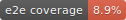

# ChatThing




A sleek AI chat application that runs entirely in your browser using Chrome's built-in Prompt API. No API keys, no cloud costs, no data leaving your device — just local AI conversations powered by Gemini Nano (Chrome) or Phi mini (Edge).

## ✨ Features

- **100% Local AI** — Leverages Chrome/Edge's built-in language models (Gemini Nano / Phi mini)
- **Zero Configuration** — No API keys or external services required
- **Privacy First** — All conversations stay on your device
- **Installable PWA** — Install ChatThing as a native-like app on any device
- **Image Understanding** — Attach images for multimodal conversations
- **Conversation History** — Persistent chat history with auto-generated titles
- **Dark/Light Themes** — System-aware theming with manual override
- **Offline Support** — Works offline once installed as a PWA
- **SSR Pre-rendered** — Fast initial loads with server-side rendering
- **Modern UI** — Clean interface built with Radix UI primitives

## 🔧 Tech Stack

| Category | Technology |
|----------|------------|
| **Framework** | React 19 with TypeScript |
| **Build Tool** | Vite (via Rolldown) |
| **Compiler** | React Compiler (automatic memoization) |
| **Styling** | Tailwind CSS v4 |
| **UI Components** | Radix UI primitives |
| **State Management** | nanostores |
| **AI Integration** | Vercel AI SDK + @built-in-ai/core |
| **Markdown** | react-markdown + remark-gfm |
| **Code Highlighting** | react-syntax-highlighter |
| **Icons** | Lucide React |
| **Deployment** | Vercel (with SSR pre-rendering) |

## 📋 Browser Requirements

This app requires a browser with the **Prompt API** enabled:

| Browser | Minimum Version | AI Model |
|---------|-----------------|----------|
| Chrome | 138+ | Gemini Nano |
| Edge | 138+ | Phi mini |

### Hardware Requirements

- **Storage**: 22 GB+ free space (for model download)
- **RAM**: 16 GB+ recommended
- **GPU**: 4+ GB VRAM (recommended for performance)

### Enabling the Prompt API

<details>
<summary><strong>Chrome Setup</strong></summary>

1. Open `chrome://flags/` in a new tab
2. Search for and enable:
   - `Prompt API for Gemini Nano`
   - `Optimization Guide On Device Model`
3. Restart Chrome
4. Visit `chrome://on-device-internals/` to download the model

</details>

<details>
<summary><strong>Edge Setup</strong></summary>

1. Open `edge://flags/` in a new tab
2. Search for and enable:
   - `Prompt API for Phi mini`
3. Restart Edge
4. Visit `edge://on-device-internals/` to download the model

</details>

## 📱 Installing as a PWA

ChatThing can be installed as a Progressive Web App for a native-like experience:

### Desktop (Chrome/Edge)
1. Visit the ChatThing website
2. Click the install icon in the address bar (or Menu → Install ChatThing)
3. Click "Install" in the dialog

### Mobile (Android)
1. Visit the ChatThing website in Chrome
2. Tap "Add to Home Screen" from the menu
3. Follow the installation prompts

### iOS (Safari)
1. Visit the ChatThing website in Safari
2. Tap the Share button
3. Scroll down and tap "Add to Home Screen"

## 🚀 Getting Started

### Prerequisites

- Node.js 20+
- Yarn (recommended) or npm
- A compatible browser with Prompt API enabled

### Installation

```bash
# Clone the repository
git clone https://github.com/jereko/chatthing.git
cd chatthing

# Install dependencies
yarn install
```

### Development

```bash
# Start the development server
yarn dev
```

The app will be available at `http://localhost:5173`

### Building for Production

```bash
# Build the application
yarn build

# Preview the production build
yarn preview
```

The build process:
1. Compiles TypeScript and bundles the client
2. Builds the SSR server bundle
3. Pre-renders static HTML for all routes

## 📁 Project Structure

```
src/
├── components/
│   ├── chat/           # Chat interface components
│   │   ├── container/  # Main chat container
│   │   ├── errors/     # Error handling UI
│   │   ├── input/      # Message input
│   │   ├── messages/   # Message display
│   │   └── sidebar/    # Conversation sidebar
│   ├── providers/      # React context providers
│   ├── settings/       # Settings page
│   └── ui/             # Reusable UI primitives
├── lib/
│   ├── ai/             # AI integration logic
│   ├── stores/         # nanostores state management
│   └── utils/          # Utility functions
├── styles/             # Global styles (Tailwind)
├── App.tsx             # Root application component
├── entry-client.tsx    # Client-side entry point
├── entry-server.tsx    # SSR entry point
└── main.tsx            # Development entry point
```

## 🛠️ Available Scripts

| Command | Description |
|---------|-------------|
| `yarn dev` | Start development server with HMR |
| `yarn build` | Build for production (client + server + prerender) |
| `yarn build:client` | Build client bundle only |
| `yarn build:server` | Build SSR server bundle only |
| `yarn prerender` | Generate pre-rendered HTML |
| `yarn preview` | Preview production build locally |
| `yarn lint` | Run ESLint |
| `yarn test` | Run unit tests in watch mode |
| `yarn test:run` | Run unit tests once |
| `yarn test:coverage` | Run unit tests with coverage |
| `yarn test:e2e` | Run E2E browser tests in watch mode |
| `yarn test:e2e:run` | Run E2E browser tests once |
| `yarn test:e2e:coverage` | Run E2E tests with coverage |
| `yarn test:all` | Run all tests (unit + E2E) |
| `yarn test:badges` | Generate coverage badge SVGs |

## 🤝 Contributing

Contributions are welcome! Please feel free to submit a Pull Request.

## 📄 License

This project is licensed under the MIT License — see the [LICENSE](LICENSE) file for details.

## 🔗 Links

- **Live Demo**: [ai.jereko.dev](https://ai.jereko.dev)
- **Chrome Prompt API Docs**: [developer.chrome.com](https://developer.chrome.com/docs/ai/built-in)
